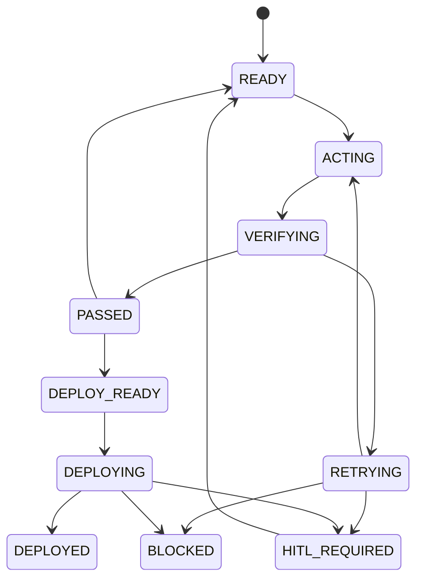

# AORR 상태 머신 설계

이 문서는 `idknow-kim/eunyoungkim-eai.github.io` 저장소를 기반으로, GitHub Pages에서 실행 가능한 정적 개인 프로페셔널 웹사이트와 Games 탭의 지렁이 게임을 안전하게 개발하기 위한 AORR 상태 머신이다.

현재 Step 1 분석 기준으로 저장소는 사실상 초기 상태이며, 루트에는 `README.md`만 확인되었다. 따라서 이 설계는 "기존 기능 보강"보다 "정적 웹사이트를 처음부터 만드는 루프"에 맞춰져 있다.

별도 백엔드 서버는 사용하지 않으며, 루트 디렉토리에는 최소한 다음 파일이 존재해야 한다.

- `index.html`
- `styles.css`
- `script.js`
- 게임 구현용 JavaScript 코드가 `script.js` 내부에 포함되거나, 별도 JS 파일로 분리될 수 있음

## 1. Target

### 프로페셔널 웹사이트 개발 목표

- 개인 소개, 경력, 프로젝트, 연락처를 한 번에 전달할 수 있는 프로페셔널 웹사이트를 만든다.
- 정적 사이트로 유지하고, GitHub Pages에 올려 바로 서비스 가능한 형태로 만든다.
- 모바일과 데스크톱 모두에서 정보 탐색이 자연스럽게 동작해야 한다.

### GitHub Pages 배포 목표

- 빌드 서버나 별도 백엔드 없이 HTML, CSS, JavaScript만으로 동작해야 한다.
- 상대경로/정적 자산 경로가 GitHub Pages에서 깨지지 않아야 한다.
- 로컬 개발 환경에서 확인한 결과가 그대로 Pages 배포에서도 유지되어야 한다.

### 입력 자료

- 현재 저장소 구조와 기존 파일
- 개인 소개 문구
- 이름 표기 방식 [사람 확인 필요]
- 경력/학력/프로젝트 목록 [사람 확인 필요]
- 연락처 및 외부 링크 [사람 확인 필요]
- 프로필 사진 또는 대표 이미지 사용 여부 [사람 확인 필요]
- Games 탭에 넣을 지렁이 게임의 규칙과 UX 우선순위 [사람 확인 필요]

### 필수 페이지와 섹션

- 상단 내비게이션
- Home 또는 Hero 영역
- About 또는 Profile 영역
- Experience 또는 Career 영역 [사람 확인 필요]
- Projects 영역
- Contact 영역
- Games 탭 또는 Games 섹션

### Games 탭 및 지렁이 게임 요구사항

- 상단에 Games 탭을 추가한다.
- 키보드로 조작 가능한 지렁이 게임을 제공한다.
- 모바일 터치로 조작 가능한 지렁이 게임을 제공한다.
- 게임은 점수, 충돌 처리, 재시작이 가능해야 한다.
- 모바일 화면에서도 조작 버튼 또는 스와이프 기반 입력이 자연스럽게 동작해야 한다.
- 게임의 난이도, 속도 증가, 보드 크기, 사운드 사용 여부는 [사람 확인 필요]일 수 있다.

### 데스크톱 및 모바일 완료 기준

- 데스크톱: 상단 내비게이션, 콘텐츠 섹션, 게임이 가독성 있게 표시된다.
- 모바일: 메뉴가 좁은 화면에서 깨지지 않고, 터치 타깃이 충분히 크다.
- 게임: 키보드 입력과 모바일 터치 입력이 모두 동작한다.
- 브라우저 콘솔에 치명적 오류가 없다.
- GitHub Pages에 배포했을 때 경로와 자산이 정상 로드된다.

## 2. Act

### 한 번의 개발 루프에서 수행할 최소 작업

한 번의 루프는 다음 조건을 만족하는 가장 작은 완료 단위로 정의한다.

- 실패 원인 1개만 수정한다.
- 관련된 최소 파일만 변경한다.
- 수정한 뒤 동일한 검증 절차를 다시 실행한다.
- 기존에 통과한 기능에 대한 회귀 테스트를 포함한다.

### 수정 가능한 파일 범위

- `index.html`
- `styles.css`
- `script.js`
- 필요 시 추가 JS 파일 1개 이상
- 정적 자산 파일

### 생성할 수 있는 파일

- `index.html`
- `styles.css`
- `script.js`
- `assets/*`
- 필요 시 별도 게임 모듈 JS 파일

### 실행 가능한 로컬 검증 명령어

아래 명령은 예시이며, 프로젝트 구조에 맞게 조정한다.

- `python -m http.server 8000`
- `npx serve .`
- 브라우저에서 `http://localhost:8000` 확인
- DevTools Console 확인
- 모바일 화면 크기 에뮬레이션 확인

## 3. Observe

### 관찰 항목

- 파일 생성 여부
- HTML 오류
- CSS 반응형 오류
- JavaScript 오류
- 로컬 웹서버 응답
- 브라우저 콘솔 오류
- 데스크톱 화면 표시
- 모바일 화면 표시
- 키보드 게임 조작
- 터치 게임 조작
- GitHub Pages 호환성

### 관찰 방법

- 파일 존재 여부는 실제 파일 시스템으로 확인한다.
- HTML/CSS/JS 오류는 브라우저와 콘솔, 정적 검사 결과로 확인한다.
- 웹서버 응답은 로컬 서버 접속 성공 여부로 확인한다.
- 게임 조작은 실제 입력 이벤트로 검증한다.
- GitHub Pages 호환성은 절대 경로 의존성, 라우팅 의존성, 외부 서버 의존성을 점검해서 확인한다.

## 4. Reason

실패 원인은 아래 분류 중 하나로만 태깅한다.

- `HTML_STRUCTURE`
- `CSS_RESPONSIVE`
- `JAVASCRIPT`
- `GAME_LOGIC`
- `GAME_CONTROL`
- `CONTENT`
- `TEST`
- `ENVIRONMENT`
- `GITHUB_PERMISSION`
- `DEPLOYMENT`
- `UNKNOWN`

### 분류 기준

- `HTML_STRUCTURE`: DOM 구조, 시맨틱 태그, 링크/섹션 배치가 잘못됨
- `CSS_RESPONSIVE`: 반응형, 레이아웃, 오버플로, 모바일 표시 문제가 있음
- `JAVASCRIPT`: 일반 스크립트 오류, 이벤트 바인딩, 상태 관리 문제
- `GAME_LOGIC`: 충돌, 점수, 이동, 생성, 종료 규칙이 잘못됨
- `GAME_CONTROL`: 키보드, 터치, 버튼 입력이 의도대로 전달되지 않음
- `CONTENT`: 개인 정보, 문구, 섹션 내용이 불명확하거나 부정확함
- `TEST`: 검증 명령 부재, 검증 실패, 재현 불가
- `ENVIRONMENT`: 로컬 실행 환경, 브라우저, 경로, 의존성 문제
- `GITHUB_PERMISSION`: 저장소 접근, 인증, Pages 설정 권한 문제
- `DEPLOYMENT`: GitHub Pages 배포 또는 경로 호환 문제
- `UNKNOWN`: 원인 특정 불가

## 5. Repeat

- 한 번에 하나의 실패 원인만 수정한다.
- 관련된 최소 파일만 변경한다.
- 수정 후 동일한 Verifier를 다시 실행한다.
- 기존에 통과한 기능에 대한 회귀 테스트를 실행한다.
- 동일한 오류 fingerprint가 반복되면 상태를 `RETRYING`에서 `BLOCKED` 또는 `HITL_REQUIRED`로 올린다.

## 6. Stop

다음 조건 중 하나를 만족하면 반복을 멈춘다.

- 전체 테스트가 통과한 경우
- 최대 Retry에 도달한 경우
- 동일한 오류 fingerprint가 2회 반복된 경우
- 개인정보나 콘텐츠 확인이 필요한 경우
- GitHub 인증 또는 배포 권한 문제가 발생한 경우

## 7. Human-in-the-loop

다음 상황에서는 사람 확인이 필요하다.

- 이름, 소개, 경력, 프로젝트 등 개인 콘텐츠가 불명확한 경우
- 기존 콘텐츠 삭제가 필요한 경우
- 외부 분석 도구나 외부 서비스를 추가해야 하는 경우
- GitHub 저장소 설정을 변경해야 하는 경우
- 요구사항이 충돌하는 경우

## 상태 정의

- `READY`: 다음 루프를 시작할 수 있음
- `ACTING`: 파일 수정 또는 구현 중
- `VERIFYING`: 수정 후 검증 수행 중
- `RETRYING`: 동일 실패를 최소 수정으로 재시도 중
- `PASSED`: 해당 루프의 검증이 통과함
- `DEPLOY_READY`: 배포 전 검증이 모두 끝남
- `DEPLOYING`: 배포 작업 수행 중
- `DEPLOYED`: GitHub Pages 배포 완료
- `BLOCKED`: 자동 반복을 계속할 수 없음
- `HITL_REQUIRED`: 사람 확인이 필요한 상태

## 루프 설계 표

| 단계 | 상태 시작 | 입력 | Act | Observe | 출력 | 테스트 기준 | 다음 상태 |
|---|---|---|---|---|---|---|---|
| 저장소 및 기존 파일 확인 | `READY` | 저장소 URL, 현재 파일 목록, Step 1 분석 결과 | 루트 파일과 기존 구조를 확인하고 현재 범위를 고정한다 | 실제 파일 존재 여부, 초기 상태, Pages 설정 여부 | 작업 범위와 초기 가정 | 루트와 기존 파일 목록을 확보함 | `PASSED` 또는 `HITL_REQUIRED` |
| 정적 사이트 기본 구조 | `READY` | 섹션 계획, 정적 사이트 목표 | `index.html`, `styles.css`, `script.js` 뼈대를 만든다 | HTML 구조, 링크, 기본 레이아웃 | 렌더링 가능한 정적 셸 | 홈 화면이 브라우저에서 뜸 | `PASSED` |
| 프로페셔널 콘텐츠 영역 | `READY` | 이름, 소개, 경력, 프로젝트, 연락처 [사람 확인 필요] | Hero/About/Experience/Projects/Contact를 채운다 | 문구, 카드, 링크, 가독성 | 프로필 정보가 보이는 페이지 | 핵심 정보가 1회 스크롤 내에서 전달됨 | `PASSED` 또는 `HITL_REQUIRED` |
| 반응형 내비게이션 | `READY` | 메뉴 항목, 모바일 우선 화면폭 | 상단 내비게이션과 모바일 메뉴를 구현한다 | 좁은 화면에서 메뉴 접힘, 클릭/탭 가능 여부 | 데스크톱/모바일 공통 내비 | 360px와 데스크톱 폭에서 메뉴 정상 | `PASSED` |
| Games 탭 | `READY` | Games 탭 위치, 라우팅 방식 [사람 확인 필요] | Games 탭과 게임 진입 UI를 추가한다 | 클릭 시 게임 영역 진입, 이동 동작 | 게임 접근 경로 | Games 탭이 내비게이션에 존재 | `PASSED` |
| 지렁이 게임 핵심 로직 | `READY` | 보드 규격, 시작 상태, 먹이/충돌 규칙 | 게임 상태, 이동, 먹이 생성, 점수, 종료를 구현한다 | 이동 및 충돌, 점수 갱신, 재시작 | 플레이 가능한 게임 루프 | 시작-이동-성장-게임오버가 동작 | `PASSED` |
| 키보드 조작 | `READY` | 방향키/WSAD 지원 여부 | 키 입력을 게임 상태와 연결한다 | 방향 전환, 입력 무시 규칙 | 키보드 플레이 가능 상태 | 키보드로 정상 이동 가능 | `PASSED` |
| 모바일 터치 조작 | `READY` | 스와이프 또는 방향 버튼 방식 [사람 확인 필요] | 터치 입력을 게임 상태와 연결한다 | 스와이프/버튼 반응, 오입력 여부 | 모바일 플레이 가능 상태 | 모바일에서 방향 제어 가능 | `PASSED` |
| 게임 UI 및 점수 | `READY` | 점수 표시 위치, 재시작 UX | 점수, 상태 메시지, 재시작 버튼을 만든다 | 점수 가시성, 종료 후 복구 가능성 | 게임 HUD | 점수와 재시작이 명확함 | `PASSED` |
| 접근성과 반응형 검증 | `READY` | 완성된 정적 사이트 | 대비, 포커스, 터치 타깃, 레이아웃 오버플로를 점검한다 | 데스크톱/모바일 화면, 키보드 접근성 | QA 결과 | 브라우저별 깨짐 없음 | `PASSED` 또는 `RETRYING` |
| GitHub Pages 호환성 검증 | `READY` | 정적 파일, 경로 규칙, Pages 제약 | 상대경로, 외부 의존성, 라우팅 문제를 점검한다 | 404 위험, 경로 깨짐, script 로딩 실패 | 배포 가능성 판단 | Pages에서 그대로 동작 가능 | `DEPLOY_READY` 또는 `BLOCKED` |
| 배포 | `DEPLOY_READY` | GitHub 저장소 권한, Pages 설정 | GitHub Pages에 배포한다 | 배포 로그, 사이트 접속 성공 | 배포 완료 사이트 | 실서비스 접속 확인 | `DEPLOYED` 또는 `HITL_REQUIRED` |

## 상태 전이 규칙

## 실패 원인별 수정 전략

- `HTML_STRUCTURE`: 섹션 구조, 내비게이션, 시맨틱 태그만 수정
- `CSS_RESPONSIVE`: 최소한의 스타일 토큰과 미디어 쿼리만 수정
- `JAVASCRIPT`: 이벤트, 상태, 렌더링 흐름만 수정
- `GAME_LOGIC`: 게임 규칙과 상태 전이만 수정
- `GAME_CONTROL`: 입력 이벤트 매핑만 수정
- `CONTENT`: 문구와 개인 정보만 수정
- `TEST`: 검증 명령과 검증 절차만 수정
- `ENVIRONMENT`: 로컬 실행 경로, 서버 명령, 브라우저 조건만 수정
- `GITHUB_PERMISSION`: 인증, 저장소 권한, Pages 설정 확인
- `DEPLOYMENT`: 정적 경로, Pages 호환성, 배포 설정 확인
- `UNKNOWN`: 원인 분해 후 재분류

## 루프 운영 원칙

- 루프는 작게 유지한다.
- 실패가 둘 이상이면 가장 아래쪽 원인부터 하나만 고친다.
- 게임과 사이트를 동시에 크게 바꾸지 않는다.
- 먼저 정적 사이트 셸을 안정화한 뒤 게임을 얹는다.
- 사람 확인이 필요한 콘텐츠는 추측으로 채우지 않는다.

## Step 1 반영 메모

- 현재 확인된 Step 1 자료에는 별도의 `[게임 추가 기능:]` 문구가 보이지 않았다.
- 따라서 이 설계는 기본 Games 탭과 지렁이 게임 요구사항만 반영했다.
- 추가 게임 기능이 존재한다면 [사람 확인 필요]로 분리하여 다시 루프를 설계한다.

## 권장 최초 상태

최초 상태는 다음과 같이 잡는 것이 안전하다.

- `저장소 및 기존 파일 확인` 완료 후 `READY`
- 개인 콘텐츠가 불명확한 영역은 `HITL_REQUIRED`
- 기술 선택과 Pages 호환성은 `DEPLOY_READY` 전까지 반복 검증

## Self-Correcting TDD Loop

이 섹션은 정적 GitHub Pages 웹사이트를 위한 Verifier 중심 Self-Correcting TDD 루프를 정의한다. 이 프로젝트에서는 “코드 수정”보다 “검증 실패를 정확히 분류하고, 최소 수정으로 되돌리는 과정”을 우선한다.

### 실제로 확인된 검증 도구

현재 환경에서 확인된 도구는 다음과 같다.

| 도구 | 확인 결과 | 사용 목적 | 비고 |
|---|---|---|---|
| `python.exe` | 존재 | 로컬 정적 서버, 간단한 스크립트 기반 검증 | 경로는 `C:\Python37\python.exe` |
| `python3` | 확인되지 않음 | `python3 -m http.server` 대체 | 없으면 사용하지 않는다 |
| `node` | 확인되지 않음 | JS 도구/린터/브라우저 자동화 | 존재하지 않는 명령은 만들지 않는다 |
| `npm` | 확인되지 않음 | 패키지/스크립트 실행 | 존재하지 않는 `npm test`를 가정하지 않는다 |
| `npx` | 확인되지 않음 | 일회성 도구 실행 | 설치 여부를 먼저 확인한다 |
| `claude` | 존재 | 독립 Verifier 후보 | `C:\Users\school\.local\bin\claude.exe`, 버전 `2.1.208` 확인됨 |

### Verifier 우선순위

1. 저장소에 실제로 존재하는 파일과 명령만 사용한다.
2. `python.exe`로 가능한 정적 검증부터 실행한다.
3. 브라우저 검증은 로컬에서 가능한 도구가 있을 때만 수행한다.
4. Claude Code CLI가 실제로 설치되어 있으면 독립 Verifier로 사용한다.
5. 없는 명령은 절대 추측해서 만들지 않는다.

### Claude Code CLI Verifier 정책

- `claude`가 실제로 존재하는 경우에만 Verifier로 사용한다.
- Sonnet 5 사용 가능 여부를 먼저 확인하고, 실제로 사용 가능한 경우에만 Sonnet 5를 선택한다.
- Sonnet 5가 보이지 않거나 선택 불가하면, 현재 사용 가능한 Sonnet 모델 중 실제로 노출되는 모델명을 기록하고 그 모델을 사용한다.
- 모델명은 추측하지 않는다.
- CLI가 없거나 모델 확인이 불가능하면 `CLAUDE_CLI_UNAVAILABLE` 또는 `ENVIRONMENT`로 분류한다.

### Verifier 체인

| 계층 | Verifier | 확인 대상 | 실패 시 분류 |
|---|---|---|---|
| 1 | 파일 시스템 검사 | `index.html`, `styles.css`, `script.js`, 게임 JS 파일 존재 | `TEST` 또는 `ENVIRONMENT` |
| 2 | 정적 HTML 검사 | 문서 구조, `title`, `meta viewport`, 시맨틱 태그, 링크 | `HTML_STRUCTURE` |
| 3 | 정적 CSS 검사 | 반응형 레이아웃, 오버플로, 내비게이션 표시 | `CSS_RESPONSIVE` |
| 4 | 정적 JS 검사 | 문법, null 참조 가능성, 이벤트 중복 가능성 | `JAVASCRIPT` |
| 5 | 게임 규칙 검사 | 시작, 일시정지, 재시작, 점수, 충돌, 입력 | `GAME_LOGIC` 또는 `GAME_CONTROL` |
| 6 | 로컬 서버 검사 | HTTP 응답, 경로 로딩, 자산 응답 | `ENVIRONMENT` 또는 `TEST` |
| 7 | 브라우저 검증 | 모바일/태블릿/데스크톱 viewport | `CSS_RESPONSIVE` |
| 8 | GitHub Pages 호환성 검사 | 루트 `index.html`, 상대경로, 서버 전용 기능 부재 | `DEPLOYMENT` |
| 9 | 독립 Verifier | Claude Code CLI, 실제 모델명 기록 | `ENVIRONMENT` 또는 `TEST` |

### Self-Correcting 루프 상태

| 상태 | 의미 | 입력 | Act | Observe | 출력 | 다음 상태 |
|---|---|---|---|---|---|---|
| `READY` | 다음 검증 또는 수정이 가능 | 현재 실패 fingerprint, 최근 통과 항목 | 가장 작은 검증 단위를 선택 | 수정 전 기준선 기록 | 실행 계획 | `ACTING` |
| `ACTING` | 최소 수정 수행 중 | 한 개의 실패 원인 | 관련 파일만 수정 | 변경 범위 기록 | 수정 후보 | `VERIFYING` |
| `VERIFYING` | 동일 Verifier 재실행 | 수정된 파일과 같은 Verifier | 동일 검증을 다시 돌림 | 실패/성공/콘솔 메시지 수집 | 검증 결과 | `PASSED` 또는 `RETRYING` |
| `RETRYING` | 동일 원인 재시도 중 | 이전 실패 fingerprint | 가설을 하나만 바꾸어 재시도 | 동일 fingerprint 반복 여부 확인 | 재시도 결과 | `PASSED`, `HITL_REQUIRED`, `BLOCKED` |
| `PASSED` | 해당 검증 통과 | 통과한 항목 | 회귀 테스트 대기열에 넣음 | 기존 기능 유지 여부 확인 | 통과 기록 | `READY` 또는 `DEPLOY_READY` |
| `DEPLOY_READY` | 배포 전 상태 | Pages 호환성 통과 결과 | 배포 전 최종 점검 | 배포 가능 여부 확인 | 배포 승인 | `DEPLOYING` |
| `DEPLOYING` | 배포 진행 중 | GitHub 권한과 Pages 설정 | Pages 배포 | 배포 로그와 접속 여부 | 배포 결과 | `DEPLOYED`, `HITL_REQUIRED`, `BLOCKED` |
| `DEPLOYED` | 배포 완료 | 실서비스 URL | 배포 결과 기록 | 실서비스 응답 | 완료 상태 | 종료 |
| `BLOCKED` | 자동 복구 중지 | 반복 실패 또는 환경 한계 | 추가 자동 수정 중단 | 원인 보존 | 중단 보고 | 종료 |
| `HITL_REQUIRED` | 사람 확인 필요 | 콘텐츠/권한/충돌 | 자동 수정 중지 | 사람 입력 대기 | 확인 요청 | `READY` |

### 검증 항목별 실패 로그 템플릿

실패 로그는 아래 필드를 모두 남긴다.

- 실행 명령어
- exit code
- 실패한 검증 항목
- 핵심 오류 메시지
- 관련 파일과 라인
- 브라우저 콘솔 메시지
- 오류 fingerprint
- 사용한 Verifier 이름
- 사용한 모델명 [Claude Code CLI 사용 시]

### 실패 원인 분류 규칙

- `HTML_STRUCTURE`: DOM 구조, 내비게이션 링크, 문서 시맨틱이 깨졌을 때
- `CSS_RESPONSIVE`: 모바일/태블릿/데스크톱에서 레이아웃 또는 오버플로가 깨졌을 때
- `JAVASCRIPT`: 문법 오류, 런타임 오류, null 참조, 중복 이벤트가 있을 때
- `GAME_LOGIC`: 게임 시작, 종료, 점수, 충돌, 먹이, 상태 전이가 잘못될 때
- `GAME_CONTROL`: 키보드/터치 입력이 의도대로 동작하지 않을 때
- `CONTENT`: 개인 정보, 소개, 프로젝트 내용이 불명확하거나 잘못됐을 때
- `TEST`: 검증 도구가 없거나, 검증 절차가 잘못됐을 때
- `ENVIRONMENT`: 로컬 서버, 경로, 브라우저, 설치 도구 같은 실행 환경 문제일 때
- `GITHUB_PERMISSION`: 저장소 접근, 인증, Pages 권한이 막혔을 때
- `DEPLOYMENT`: GitHub Pages 호환성 또는 배포 경로가 문제일 때
- `UNKNOWN`: 분류가 불가능할 때

### 최소 수정 원칙

- 한 Retry에서는 하나의 원인만 수정한다.
- 관련 파일만 수정한다.
- 테스트 삭제 또는 검증 기준 완화는 금지한다.
- 전체 사이트의 불필요한 재작성은 금지한다.
- 이미 통과한 기능을 깨뜨리는 수정은 금지한다.
- 외부 프레임워크로 임의 전환하지 않는다.

### Retry 정책

- 하나의 오류에 대해 최대 3회까지 시도한다.
- 동일 오류 fingerprint가 2회 반복되면 중지한다.
- 각 Retry마다 가설, 변경 파일, 실행 명령어, 결과를 기록한다.
- 환경 또는 권한 문제는 코드 수정으로 해결하려 하지 않는다.

### Self-Correcting 루프의 실행 순서

| 순서 | 검증 주제 | 주요 Verifier | 성공 조건 | 실패 시 처리 |
|---|---|---|---|---|
| 1 | 기본 파일 검증 | 파일 시스템 검사 | 루트에 필수 파일 존재 | `TEST` 또는 `ENVIRONMENT` |
| 2 | HTML 검증 | HTML 구조 점검 | 기본 구조, viewport, 내비게이션, Games 영역 통과 | `HTML_STRUCTURE` |
| 3 | CSS 검증 | 반응형 렌더링 점검 | 모바일/태블릿/데스크톱에서 깨짐 없음 | `CSS_RESPONSIVE` |
| 4 | JavaScript 검증 | 문법 및 런타임 점검 | 콘솔 오류 없음, null 참조 없음 | `JAVASCRIPT` |
| 5 | 지렁이 게임 검증 | 기능 및 입력 점검 | 시작/일시정지/재시작/점수/충돌/입력 통과 | `GAME_LOGIC` 또는 `GAME_CONTROL` |
| 6 | 로컬 실행 검증 | HTTP 서버 응답 | `index.html`과 자산이 HTTP로 로드됨 | `ENVIRONMENT` |
| 7 | 브라우저 검증 | viewport 검증 | 약 375px/768px/1440px에서 정상 표시 | `CSS_RESPONSIVE` |
| 8 | GitHub Pages 호환성 | 정적 호환성 점검 | 루트 `index.html`, 상대경로, 서버 전용 기능 없음 | `DEPLOYMENT` |
| 9 | Claude 독립 Verifier | Claude Code CLI | 사용 가능 모델명 기록 포함 검증 | `ENVIRONMENT` 또는 `TEST` |

### 정지 조건

아래 조건 중 하나가 만족되면 Self-Correcting 루프를 멈춘다.

- 전체 검증이 통과한 경우
- 최대 Retry에 도달한 경우
- 동일 오류 fingerprint가 2회 반복된 경우
- 개인정보나 콘텐츠 확인이 필요한 경우
- GitHub 인증 또는 배포 권한 문제가 발생한 경우
- Claude Code CLI 또는 모델 선택 상태를 확인할 수 없는 경우

### 사람 확인이 필요한 지점

- 이름, 소개, 경력, 프로젝트 등 개인 콘텐츠가 불명확한 경우
- 기존 콘텐츠 삭제가 필요한 경우
- Games 탭에 추가 기능이 필요한 경우
- GitHub 저장소 설정을 변경해야 하는 경우
- Claude Code CLI가 없거나 모델명이 확인되지 않는 경우
